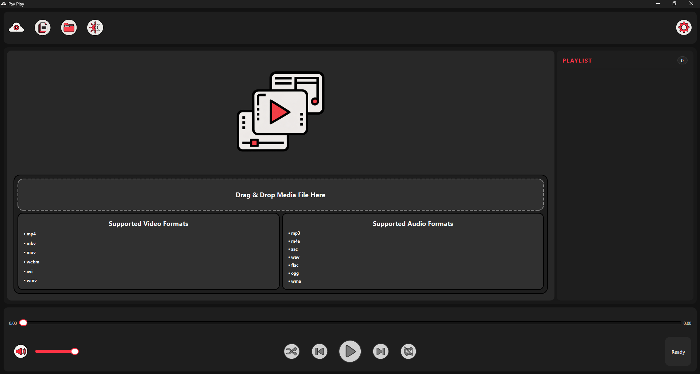
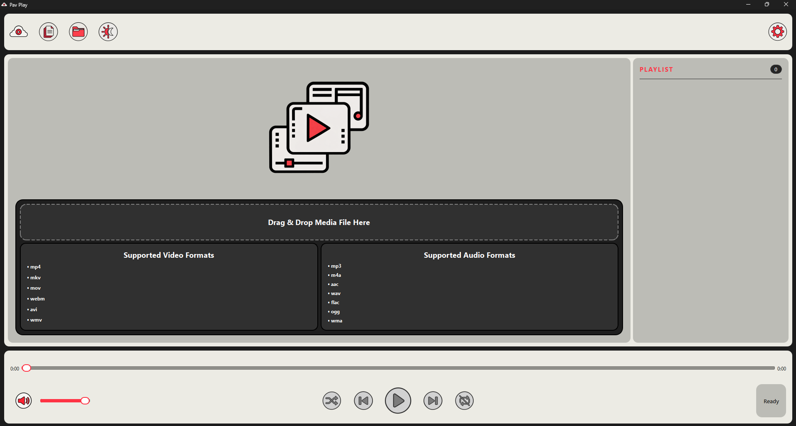
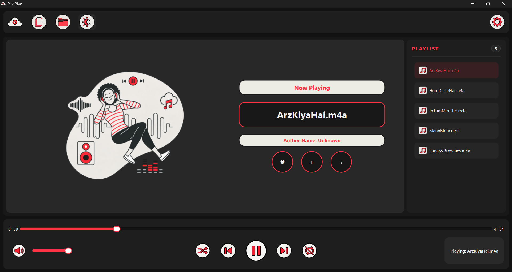
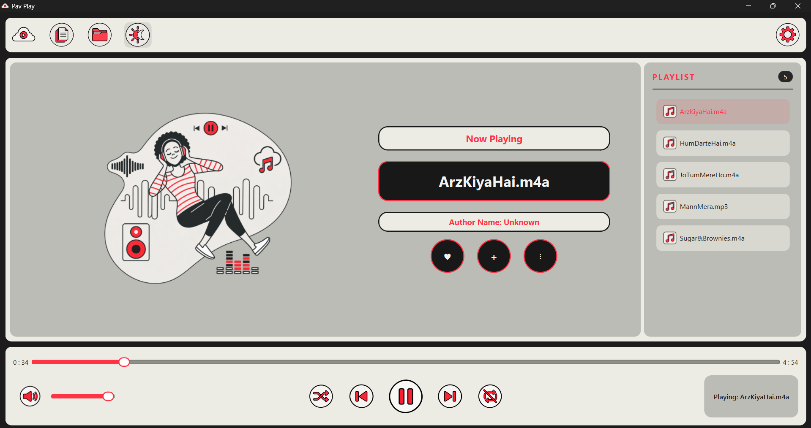
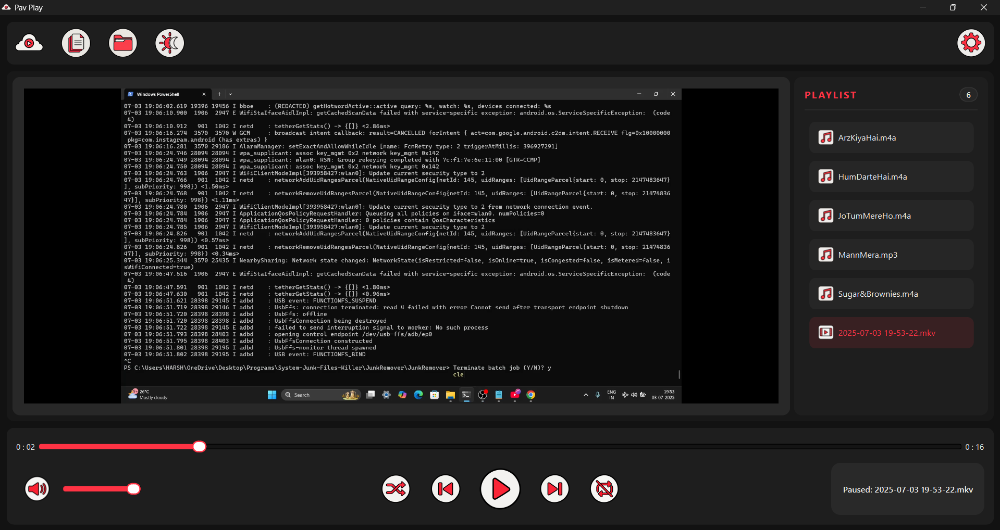
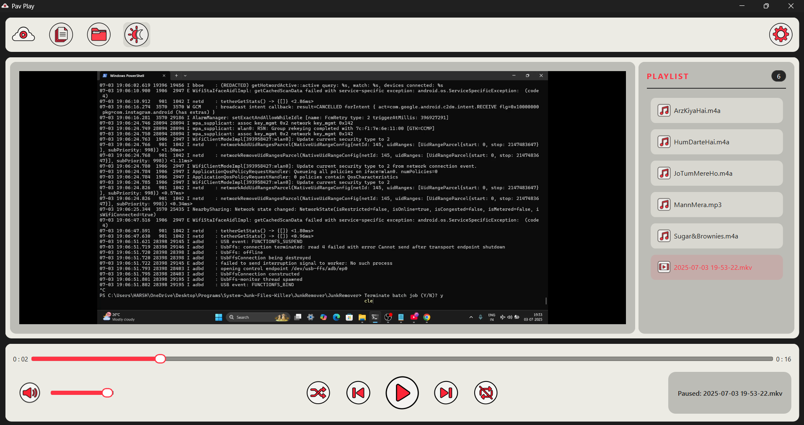

# 🎵 Pav Play

Pav Play is a simple and lightweight **media player built with Python and PySide6**.

The goal of this project is to create a clean desktop media player capable of playing both **audio and video files**, while providing features such as playlists, drag-and-drop support, media controls, and a modern user interface.

> ⚠️ **Project Status: Under Development**
>
> Pav Play is currently being actively developed. Features, UI, project structure, and implementation may change frequently.

---

## Screenshots:

**_Dashboard Page Dark And Light Mode:_**



**_Audio Page Dark And Light Mode:_**



**_Video Page Dark And Light Mode:_**



## ✨ Current Features

- 🎵 Audio playback
- 🎬 Video playback
- 📂 Open individual media files
- 📁 Open folders containing media files
- 🖱️ Drag and drop media files
- 📃 Playlist support
- ⏮️ Previous media
- ▶️ Play / Pause
- ⏭️ Next media
- 🔊 Volume control
- 🔇 Mute / Unmute
- ⏱️ Media progress slider
- 🌙 Theme toggle
- 📌 Currently playing media information

---

## 🖼️ Supported Media

### Video

- `.mp4`
- `.mkv`
- `.mov`
- `.webm`
- `.avi`
- `.wmv`

### Audio

- `.mp3`
- `.m4a`
- `.aac`
- `.wav`
- `.flac`
- `.ogg`
- `.wma`

> Actual playback support may depend on the multimedia backend available on the user's system.

---

## 🛠️ Built With

- Python
- PySide6
- Qt Multimedia

---

## 📁 Project Status

The project is currently focused on completing the first stable version.

Some parts of the codebase are still experimental and may be refactored later. A `TECH_DEBT.md` file is included to track areas planned for improvement.

---

## 🚀 Installation

Clone the repository:

```bash
git clone <https://github.com/VadaPavMan/Pav-Play>
```

Install dependencies:

```bash
pip install -r requirements.txt
```

Run the application:

```bash
python src/main.py
```

---

## 🔮 Planned Features

- Improved audio player interface
- Better video controls
- Media metadata display
- Album artwork
- Improved playlist management
- Keyboard shortcuts
- Settings system
- UI improvements and animations
- Codebase refactoring
- Better media format handling

---

## 🤝 Contributing

Pav Play is currently in active development. Contributions, suggestions, and feedback may be welcomed once the project reaches a more stable state.

---

## 📄 License

License information will be added in a future release.

+--------------------------------------------------------+
| Menu Bar |
+--------------------------------------------------------+
| |
| Album Art Song Name |
| Artist |
| |
|--------------------------------------------------------|
| |
| Playlist (QListWidget) |
| |
| |
| |
|--------------------------------------------------------|
| << ▶ >> -----------Slider----------- 03:20 |
| |
| Volume 🔊 --------Slider------------------- |
+--------------------------------------------------------+

# Refactoring job

PavPlay/
│
├── pavplay/
│ ├── **init**.py
│ ├── main.py
│ │
│ ├── ui/
│ │ ├── main_window.py
│ │ ├── controls_bar.py
│ │ └── navigation_bar.py
│ │
│ ├── controllers/
│ │ ├── player_controller.py
│ │ └── playlist_controller.py
│ │
│ ├── widgets/
│ │ └── drop_area.py
│ │
│ ├── models/
│ │ └── media_item.py
│ │
│ └── core/
│ ├── icons.py
│ ├── formats.py
│ └── settings.py
│
├── assets/
├── tests/
├── README.md
├── CONTRIBUTING.md
├── TECH_DEBT.md
└── requirements.txt

# Repo Link:

`https://github.com/VadaPavMan/Pav-Play`

# Dark And Light Mode:

- Dark Mode:

```
- Window       #121212
- Navigation   #1E1E1E
- Player       #282828
- Playlist     #1E1E1E
- Controls     #1E1E1E
- Text         #F2F2F2
- Accent       #FF3344
```

- Light Mode:

```
- Window       #F2F2F2
- Navigation   #FFFFFF
- Player       #E6E6E6
- Playlist     #FFFFFF
- Controls     #FFFFFF
- Text         #181818
- Accent       #FF3344
```

#767572

Settings Page Structure:
MainUi
│
├── Main Navigation
│ ├── Files
│ ├── Folder
│ ├── Theme
│ └── Settings
│
├── Main Media Area
│ ├── Placeholder
│ ├── Video Player
│ └── Audio Player
│
└── Settings Page
│
├── Settings Sidebar
│ ├── Back
│ ├── Audio
│ ├── Video
│ ├── Core
│ ├── Help
│ └── About
│
└── Settings Content
├── Audio Settings Page
├── Video Settings Page
├── Core Settings Page
├── Help Page
└── About Page
