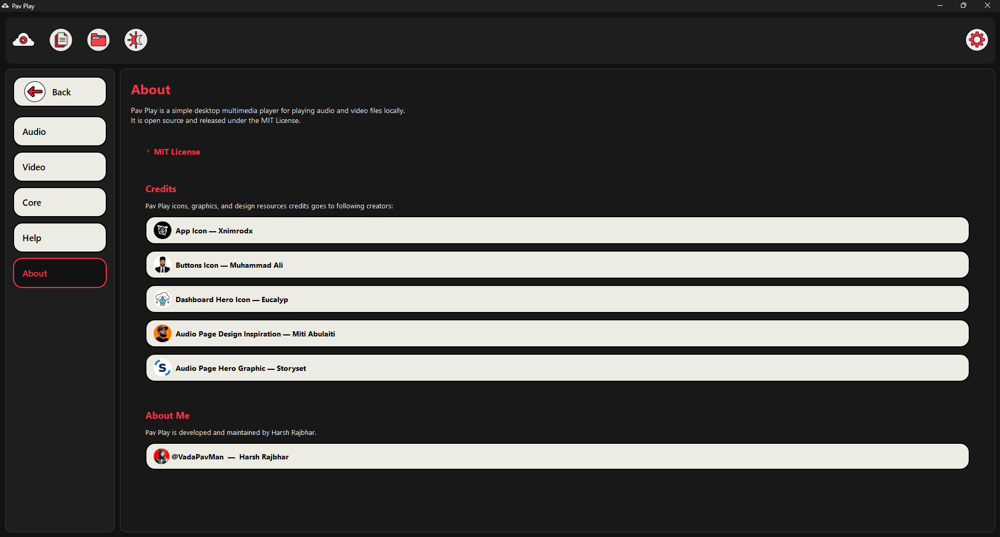
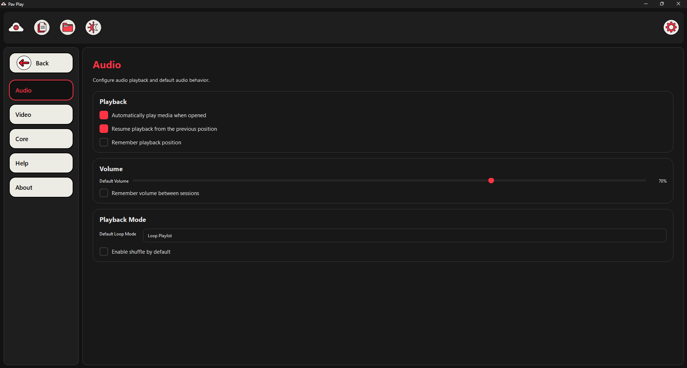
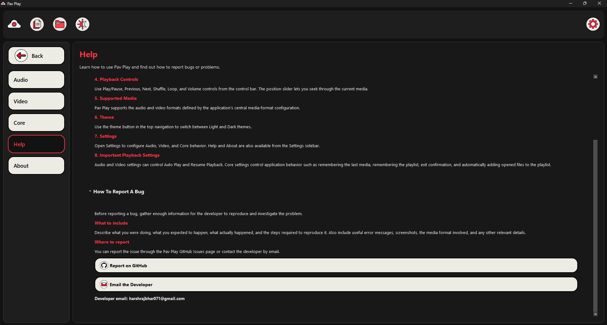
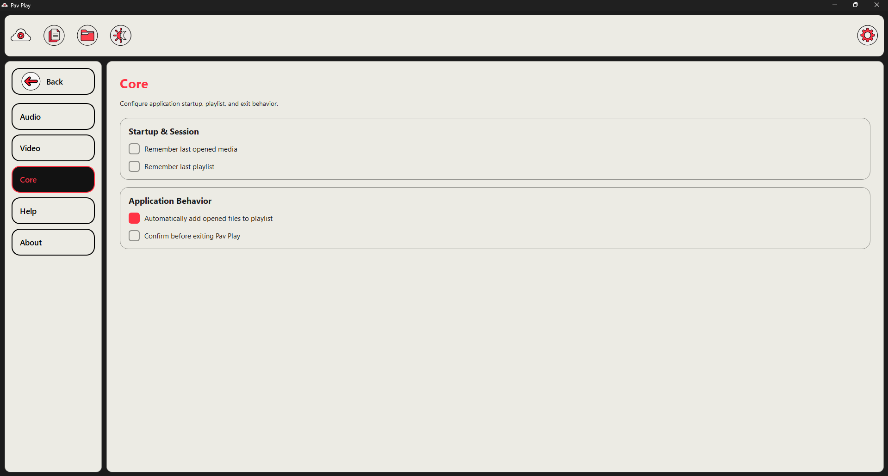
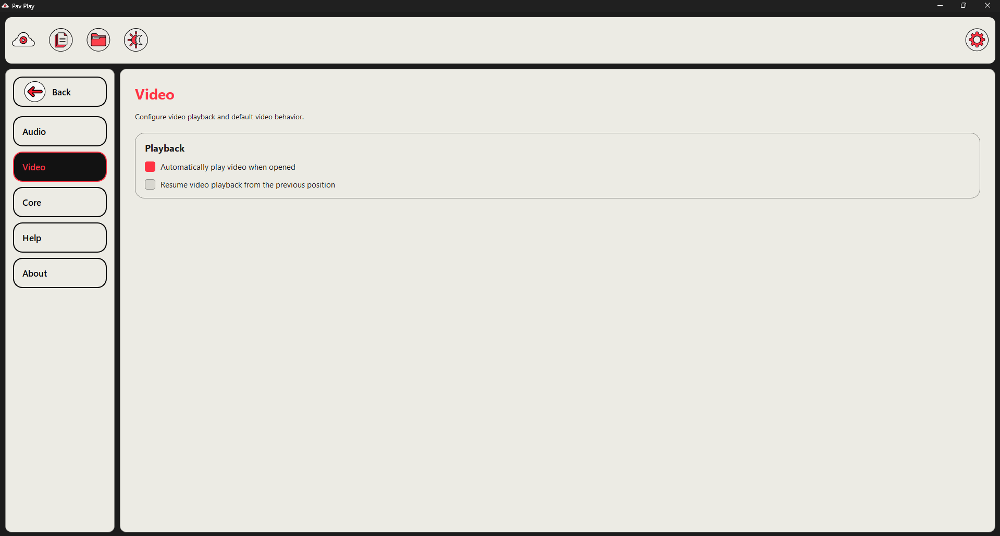

# 🎵 Pav Play

Pav Play is a simple and lightweight **desktop multimedia player built with Python, PySide6, and Qt Multimedia**.

It is designed to play local audio and video files while providing playlist management, drag-and-drop input, playback controls, theme switching, media information, persistent settings, and keyboard shortcuts.

> ✅ **Project Status: v1 stabilization complete**
>
> The main v1 feature set has been implemented and the project has gone through dedicated stabilization passes.
> Phase 6 is reserved for architectural refactoring and broader codebase cleanup.

---

## ✨ Current Features

- 🎵 Audio playback
- 🎬 Video playback
- 📂 Open individual media files
- 📁 Open folders containing supported media files
- 🖱️ Drag and drop files and folders
- 📃 Playlist support
- ⏮️ Previous media
- ▶️ Play / Pause
- ⏭️ Next media
- 🔊 Volume control
- 🔇 Mute / Unmute
- ⏱️ Media progress and seeking
- 🔀 Shuffle playback
- 🔁 Loop Off / Loop Playlist / Loop One
- 🌙 Light / Dark theme toggle
- 📌 Currently playing media information
- 🎼 Audio artist metadata display
- ⚙️ Audio, Video, and Core settings
- 💾 Persistent application settings
- ▶️ Optional resume playback
- 🧠 Optional last-media / playlist persistence
- ⌨️ Playback and file-opening keyboard shortcuts
- ⚠️ Playback and invalid-media error handling

---

## ⌨️ Keyboard Shortcuts

| Shortcut           | Action                  |
| ------------------ | ----------------------- |
| `Space`            | Play / Pause            |
| `←`                | Seek backward 5 seconds |
| `→`                | Seek forward 5 seconds  |
| `↑`                | Increase volume by 5%   |
| `↓`                | Decrease volume by 5%   |
| `M`                | Mute / Unmute           |
| `N`                | Next media              |
| `P`                | Previous media          |
| `S`                | Toggle Shuffle          |
| `L`                | Cycle Loop mode         |
| `Ctrl + O`         | Open media files        |
| `Ctrl + Shift + O` | Open folder             |

---

## 🖼️ Supported Media

### Video

- `.mp4`
- `.mkv`
- `.mov`
- `.webm`
- `.avi`
- `.wmv`

### Audio

- `.mp3`
- `.m4a`
- `.aac`
- `.wav`
- `.flac`
- `.ogg`
- `.wma`

> Actual playback support can depend on the multimedia backend, codecs, and operating system.

---

## 🛠️ Built With

- **Python**
- **PySide6**
- **Qt Multimedia**
- **Mutagen** for audio metadata

---

## 📸 Screenshots

### Dashboard — Dark and Light


### Audio Page — Dark and Light


### Video Page — Dark and Light


### Settings Page - Dark and Light







---

## 📁 Project Structure

```text
Pav-Play/
├── assets/
├── controllers/
│   ├── formatTime.py
│   ├── metadata.py
│   └── player_controller.py
├── core/
│   ├── formats.py
│   └── link.py
├── src/
│   ├── icons.py
│   ├── main.py
│   ├── ui.py
│   └── settings/
│       ├── settings_page.py
│       ├── settings_manager.py
│       ├── settings_defaults.py
│       └── pages/
│           ├── audio_settings.py
│           ├── video_settings.py
│           ├── core_settings.py
│           ├── help_page.py
│           └── about_page.py
├── widgets/
│   └── drop_area.py
├── test/
├── CREDITS.md
├── README.md
├── requirements.txt
└── TECH_DEBT.md
```

---

## 🚀 Installation

### 1. Clone the repository

```bash
git clone https://github.com/VadaPavMan/Pav-Play.git
cd Pav-Play
```

### 2. Create a virtual environment

**Windows:**

```bash
python -m venv .venv
.venv\Scripts\activate
```

**Linux / macOS:**

```bash
python3 -m venv .venv
source .venv/bin/activate
```

### 3. Install dependencies

```bash
python -m pip install -r requirements.txt
```

### 4. Run Pav Play

```bash
python src/main.py
```

---

## ⚙️ Settings

Pav Play includes separate settings for:

### Audio

- Auto Play
- Resume Playback
- Remember Playback Position
- Default Volume
- Remember Volume
- Default Loop Mode
- Default Shuffle

### Video

- Auto Play
- Resume Playback

### Core

- Remember Last Media
- Remember Last Playlist
- Confirm Before Exit
- Automatically Add Opened Files to Playlist

Settings are persisted using Qt's settings system.

---

## 🤝 Contributing

Pav Play is an open-source project.

The first stable feature set is being maintained before the larger architecture refactor begins. See `TECH_DEBT.md` for the planned refactoring work and current technical debt.

---

## 📄 License

Pav Play is released under the **MIT License**.

---

## 🗺️ Development Roadmap

```text
Phase 1  → Playlist behavior
Phase 2  → Media opening / folders / drag & drop
Phase 3  → Audio / video polish and media switching
Phase 4  → Error handling / shortcuts / edge-case testing
Phase 5  → v1 stabilization        ✅
Phase 6  → Architecture refactor   → next
```

---

## 🔗 Repository

https://github.com/VadaPavMan/Pav-Play
